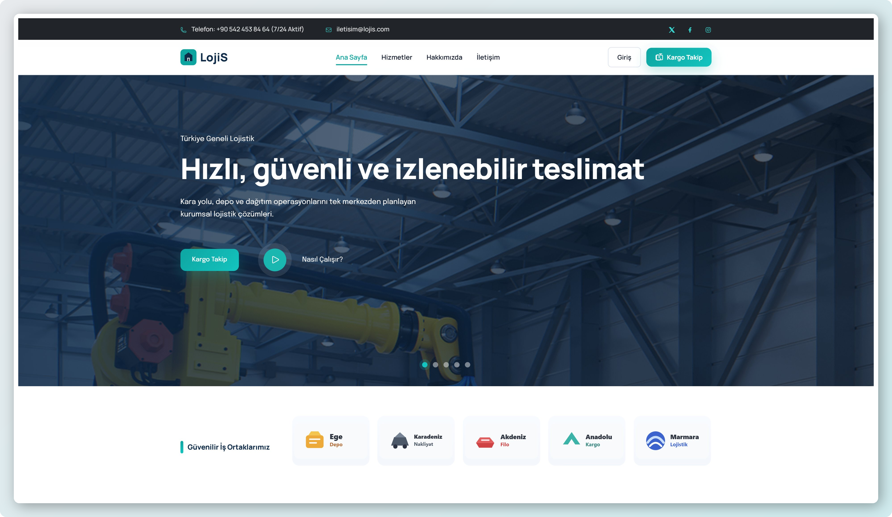
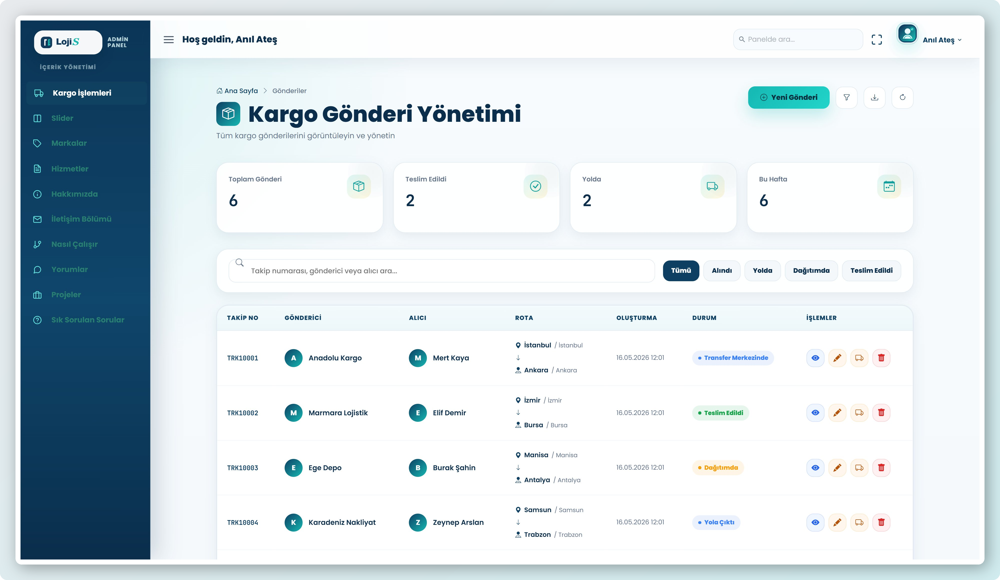
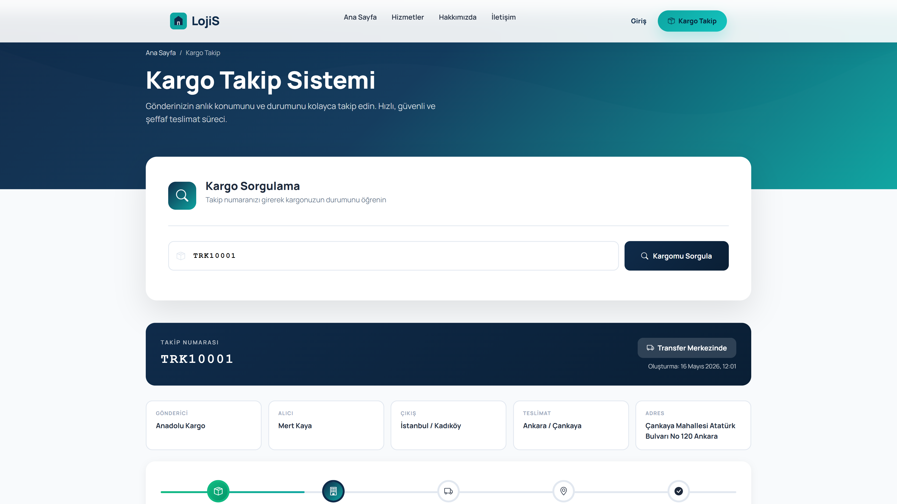

# Logistics CMS

Logistics CMS is an ASP.NET Core MVC application for managing logistics website content, shipment records, and shipment tracking history through an admin-focused CMS structure.

The project uses MongoDB as the database layer and follows a service-based MVC structure with DTOs, AutoMapper mappings, reusable CRUD services, cookie authentication, and Razor View-based admin screens.

---

## About the Project

This project started as a logistics-themed CMS and was later redesigned into a more complete management panel.

The application is built around two main areas:

- A public logistics website with dynamic content sections
- An admin panel for managing CMS content, shipments, and tracking updates

Instead of keeping all logic inside controllers, the project separates responsibilities through services, DTOs, AutoMapper profiles, MongoDB collections, and reusable base classes.

---

## Main Features

- ASP.NET Core MVC structure
- MongoDB integration with typed collection access
- Admin login with cookie authentication
- PBKDF2-based password hashing for admin credentials
- Protected admin routes with role-based authorization
- Reusable MongoDB CRUD service base
- DTO-based create, update, result, and detail models
- AutoMapper profile for model and DTO mapping
- Shipment management
- Shipment tracking history management
- Automatic shipment status update from tracking events
- CMS modules for landing page content
- Razor View-based admin interface
- HTTP request logging
- Centralized error and status page handling
- Configuration-based database and auth settings

---

## CMS Modules

The admin panel includes management screens for:

- Sliders
- Brands
- Offers
- About content
- Get in touch section
- How it works section
- Testimonials
- Project sections
- Questions / FAQ
- Shipments
- Shipment tracking events

---

## Screenshots

### Public Website



### Admin Panel



### Shipment Tracking



---

## Shipment Management

The shipment module manages delivery records such as sender, receiver, origin city, destination city, tracking number, and current shipment status.

Tracking events are stored under the related shipment record. When a new tracking event is added or updated, the shipment's current status is also updated.

This makes the tracking flow easier to follow from the admin side and keeps the shipment state connected with its latest movement.

---

## Tech Stack

### Backend

- ASP.NET Core MVC
- C#
- .NET 10
- MongoDB
- MongoDB.Driver
- AutoMapper
- Cookie Authentication
- Options Pattern
- Dependency Injection

### Frontend

- Razor Views
- HTML
- CSS
- JavaScript
- Bootstrap

### Architecture

- MVC Pattern
- Service Layer
- DTO-based data transfer
- Reusable CRUD base service
- ViewComponents
- Configuration-based settings

### Tools

- Git
- GitHub
- Visual Studio

---

## Project Structure

```text
DotnetMVCCore-LogisticsCms
└── LogisticsCMS
    ├── Controllers
    ├── Dtos
    ├── Mapping
    ├── Models
    ├── Services
    │   ├── About
    │   ├── Brand
    │   ├── GetInTouchSection
    │   ├── HowItWork
    │   ├── Offer
    │   ├── ProjectSection
    │   ├── Question
    │   ├── Security
    │   ├── Shipment
    │   ├── ShipmentTracking
    │   ├── Slider
    │   └── Testimonial
    ├── Settings
    ├── ViewComponents
    ├── Views
    ├── wwwroot
    └── Program.cs
```

---

## Architecture Notes

The application keeps controllers focused on request handling and page flow.

Business and database operations are handled inside service classes. Common MongoDB CRUD operations are shared through a reusable base service, which reduces repeated code across CMS modules.

MongoDB collection names and database settings are loaded from configuration. The application uses a shared MongoDB context to access typed collections.

Admin authentication is handled with cookie authentication. The password hash is configured through application settings, user secrets, or environment variables instead of storing a plain-text password in the code.

---

## Authentication

The admin panel uses cookie-based authentication.

Admin credentials are configured through `AuthSettings`:

```json
{
  "AuthSettings": {
    "Username": "admin",
    "PasswordHash": "YOUR_PASSWORD_HASH",
    "DisplayName": "Admin"
  }
}
```

The password hash is generated and verified using PBKDF2 with SHA-256.

Protected CMS controllers inherit from a shared base controller that requires the `Admin` role.

---

## MongoDB Configuration

MongoDB settings are configured through `DatabaseSettings`:

```json
{
  "DatabaseSettings": {
    "ConnectionString": "mongodb://localhost:27017",
    "DatabaseName": "DatabaseMasteryDb",
    "SliderCollectionName": "Sliders",
    "BrandCollectionName": "Brands",
    "OfferCollectionName": "Offers",
    "AboutCollectionName": "Abouts",
    "GetInTouchSectionCollectionName": "GetInTouchSections",
    "HowItWorkCollectionName": "HowItWorks",
    "TestimonialCollectionName": "Testimonials",
    "ProjectSectionCollectionName": "ProjectSections",
    "QuestionCollectionName": "Questions",
    "ShipmentCollectionName": "Shipments"
  }
}
```

---

## How the Application Works

The public side renders logistics website sections through Razor Views and ViewComponents.

The admin side allows authenticated users to manage website content and shipment records. Each module has its own controller, DTOs, service interface, service implementation, and MongoDB collection.

For shipment tracking, events are added to the related shipment document. The current shipment status is updated from the latest tracking action, so the shipment record and tracking history stay connected.

---

## Installation

### Clone the repository

```bash
git clone https://github.com/anilates97/DotnetMVCCore-LogisticsCms.git
cd DotnetMVCCore-LogisticsCms/LogisticsCMS
```

### Restore dependencies

```bash
dotnet restore
```

### Configure MongoDB

Make sure MongoDB is installed and running locally, or update the connection string for your own MongoDB instance.

Default local connection:

```json
{
  "DatabaseSettings": {
    "ConnectionString": "mongodb://localhost:27017",
    "DatabaseName": "DatabaseMasteryDb"
  }
}
```

### Configure admin password hash

Set `AuthSettings:PasswordHash` using user secrets or environment variables.

Example with user secrets:

```bash
dotnet user-secrets set "AuthSettings:PasswordHash" "YOUR_PASSWORD_HASH"
```

### Run the application

```bash
dotnet run
```

The application starts with the public logistics website. Admin pages require login.

---

## Development Notes

- Controllers stay thin and delegate data operations to services.
- DTOs are used instead of passing MongoDB models directly between layers.
- AutoMapper handles model and DTO conversions.
- Repeated MongoDB CRUD behavior is centralized in `MongoCrudServiceBase`.
- Shipment tracking is stored as part of the shipment document.
- Login failures and application errors are logged.
- Production error pages and status code pages are handled through the MVC error flow.
- Authentication settings are validated during application startup.

---

## Developer

**Anıl Hasan Ateş**

- LinkedIn: https://linkedin.com/in/anilates97
- GitHub: https://github.com/anilates97
- Portfolio: https://anilates.vercel.app/
